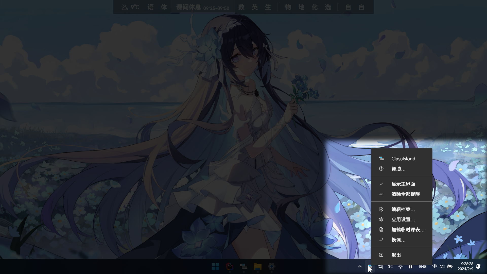
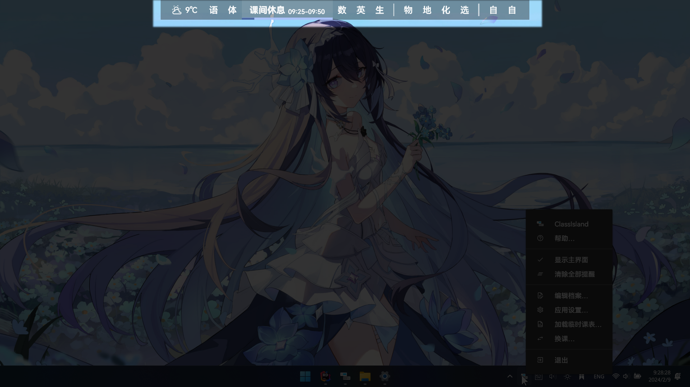

# 基本

本文档主要讲述应用的基本操作。

## 主菜单

应用在启动时，会在系统托盘创建一个托盘图标。在启动软件后，本应用会在任务栏托盘中显示软件的图标。如果您没有看到这个图标，请点击托盘左侧的展开按钮展开托盘菜单，并考虑将本软件的图标固定到任务栏上。

点击这个图标，可以打开软件的主菜单。本软件的各个功能都需要从这里访问。您可以右键托盘图标打开主菜单，访问应用的各个功能。

## 主界面

应用会在桌面上创建一个具有半透明背景的窗口，默认停靠在屏幕中上方。该窗口会显示启用的课表，并标注当前的时间点。

当鼠标移到主界面上方时，主界面会自动降低不透明度，确保不遮挡窗口后方内容。鼠标点击可以穿透窗口，操作窗口后方的内容。

> [!warning]
> 默认情况下，ClassIsland 使用 RawInput 来接收输入事件。这种方法可以允许 ClassIsland 分别对鼠标和触摸输入做出更适合的响应，但兼容性不佳。如果此功能在您的设备上无法正常工作，可以在在[【应用设置】→【窗口】](classisland://app/settings/window)】中关闭【使用原始输入】选项。

本软件的主界面默认会显示在屏幕的上方，课表、提醒等信息都会显示在此处。当处于某个课程时，对应课程会展开显示，并在下方显示进度条。

在[【应用设置】→【窗口】](classisland://app/settings/window)中，您可以调整主界面的停靠位置和窗口层级，以及指针移入隐藏的相关选项。

在[【应用设置】→【外观】](classisland://app/settings/appearance)中，您可以调整主界面的缩放大小和背景不透明度。

## 附加信息

应用的课表组件默认会在当前的时间点旁显示附加信息（如图）。

您可以在对应的[组件设置](classisland://app/settings/components)中开关附加信息的显示，以及调整显示的信息内容。

## 时间点结束倒计时

::: warning 

这和即将上课倒计时不是一个东西。要调整即将上课倒计时，请在[【提醒】](classisland://app/settings/notification/08F0D9C3-C770-4093-A3D0-02F3D90C24BC)选项卡中调整相关设置。
:::

应用默认会在时间点结束前 60 秒在显示附加信息的位置显示时间点结束读秒。

您可以在对应的[组件设置](classisland://app/settings/components)中调整此功能。
