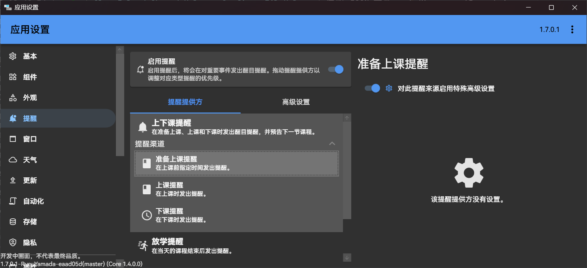
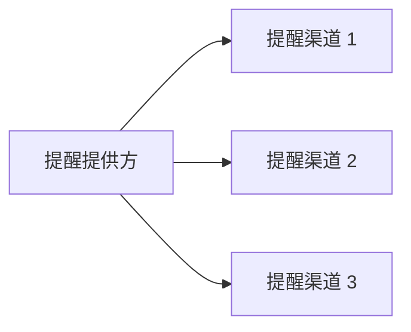

# 提醒渠道



提醒提供方除了可以以[提醒提供方](./index.md#注册提醒提供方)为单位发送提醒和指定提醒高级设置，还可以以更细化的单位—— *提醒渠道*发送提醒和指定提醒高级设置。此功能适合包含较多提醒种类的提醒提供方来在逻辑上对发送的提醒进行细分，并便于用户为不同的提醒种类指定提醒高级设置。提醒渠道与提醒提供方的关系如下：



本文章假定您已阅读并了解文章[基本](./index.md)包含的内容，建议未阅读此文章的开发者先阅读此文章，以了解提醒的相关概念。接下来我们介绍如何使用此功能。

## 注册提醒渠道

注册提醒渠道的方法很简单，只需要在要注册提醒渠道的提醒提供方定义上添加[`NotificationChannelInfo`属性](https://api.docs.classisland.tech/api/ClassIsland.Core.Abstractions.Services.NotificationProviders.NotificationChannel.html?q=NotificationChannel)：

``` csharp title="Services/NotificationProviders/MyNotificationProvider.cs"
// ...

[NotificationChannelInfo("1F77CCAE-3639-2EB5-8E5D-938885FEC5BD", "提醒渠道", PackIconKind.Class, description:"一个提醒渠道。")]
public class MyNotificationProvider : NotificationProviderBase<MyNotificationSettings>
{
    // ...
}
```

上面的代码为提醒提供方 MyNotificationProvider 类添加了一个[`NotificationChannelInfo`属性](https://api.docs.classisland.tech/api/ClassIsland.Core.Abstractions.Services.NotificationProviders.NotificationChannel.html?q=NotificationChannel)，指定了提醒提供方的名称、图标、描述等相关信息。

``` csharp
[NotificationChannelInfo(
    "1F77CCAE-3639-2EB5-8E5D-938885FEC5BD", // 提醒渠道 GUID
    "提醒渠道", // 提醒渠道名称
    PackIconKind.Class,  // 提醒渠道图标
    description:"一个提醒渠道。" // 提醒渠道描述
)]
```

这样我们就把提醒渠道添加到这个提醒提供方上了，接下来我们就可以通过这个提醒渠道发送提醒了。

## 按渠道发送提醒

这里介绍两种按渠道发送提醒的方法。

### 通过提醒渠道发送提醒

