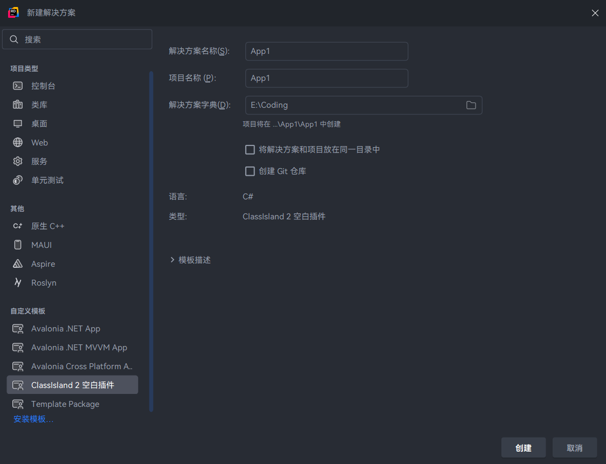
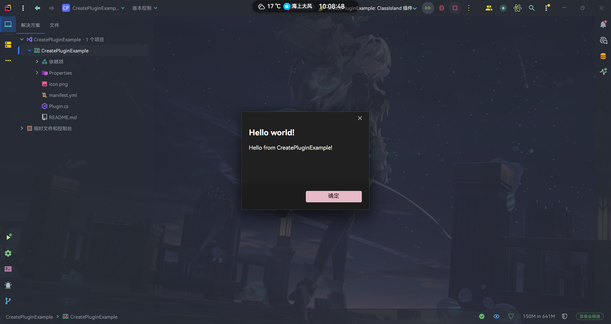

# 开始编写插件

本文章将介绍如何创建、调试并运行 ClassIsland 的插件项目。

## 设置开发环境

在开始之前，您需要按照[设置 ClassIsland 插件开发环境](../get-started/devlopment-plugins.md)的指引设置插件开发环境。

## 创建项目

您可以使用项目模板快速开始开发。

1. 如果您没有安装过模板包，先运行以下命令安装模板包

    ``` bash
    dotnet new install ClassIsland.PluginTemplate.Packaging
    ```

2. 在 JetBrains Rider 或其它支持的编辑器中中选择此模板创建项目

    

    或者在 .NET CLI 中通过以下命令行创建项目

    ``` bash title="通过命令行创建"
    # MyPlugin 是您的插件项目名称
    mkdir MyPlugin
    cd MyPlugin
    dotnet new cipx-template -n MyPlugin
    ```

3. 打开并运行项目。
    

🎉恭喜！您成功创建了您的第一个插件！

## 认识插件结构

在使用模板创建插件后，您会看到项目内已经有了一些文件，以下是这些文件的大致用途：

``` plaintext
MyPlugin
 |- MyPlugin.csproj          // 项目文件
 |- Plugin.cs                // 插件入口点
 |- manifest.yml             // 插件清单文件
 |- README.md                // 插件自述文件
 |- icon.png                 // 插件图标
 |- Properties               // 项目属性（如启动配置等）文件夹
    |- launchSettings.json   // .NET 项目启动配置
```

这些文件的具体用途将在之后介绍。

## 插件清单文件

插件清单文件`manifest.yml`包含了插件的基本信息，如插件入口程序集等。使用插件模板创建的项目的清单文件已经基本配置完毕，您只需按照需要进行微调。

清单文件具有以下属性：

| 属性名 | 类型 | 必填？ | 说明 |
| -- | -- | -- | -- |
| id | `string` | **是** | 插件的唯一 id |
| entranceAssembly | `string` | **是** | 插件入口程序集。在加载插件时将从这个程序集中查找插件入口点。 |
| apiVersion | `Version` | **是** | 此插件面向的 ClassIsland 版本。此插件将只能在高于此版本的 ClassIsland 上工作。 |
| name | `string` | 否 | 插件显示名称 |
| description | `string` | 否 | 插件描述 |
| url | `string` | 否 | 插件主页 Url |
| author | `string` | 否 | 插件作者 |
| version | `Version` | 否 | 插件版本，如`1.0.0.0` |
| icon | `string` | 否 | 插件图标文件名，默认值为`icon.png` |
| readme | `string` | 否 | 插件自述文件文件名，默认为`README.md` |

以下是一个清单文件的示例：

```yaml title="manifest.yml"
id: examples.helloworld  # 插件 id
name: Hello world!  # 插件名称
apiVersion: 2.0.0.0  # 插件面向的 ClassIsland 版本
description: 在启动时弹出一个“Hello world”提示框。  # 插件描述
entranceAssembly: "HelloWorldPlugin.dll"  # 插件入口程序集
url: https://github.com/ClassIsland/ExamplePlugins  # 插件 Url
author: HelloWRC  # 插件作者
version: 1.0.0.0  # 插件版本
```

## 继续深入

您可以继续阅读本文档来进一步了解相关 API 的用法，或者查看 GitHub 上的 [插件示例](https://github.com/ClassIsland/ExamplePlugins)。您也可以看看[插件功能请求板块](https://github.com/ClassIsland/ClassIsland/discussions/categories/%E6%8F%92%E4%BB%B6%E5%8A%9F%E8%83%BD%E8%AF%B7%E6%B1%82)来寻找灵感。
