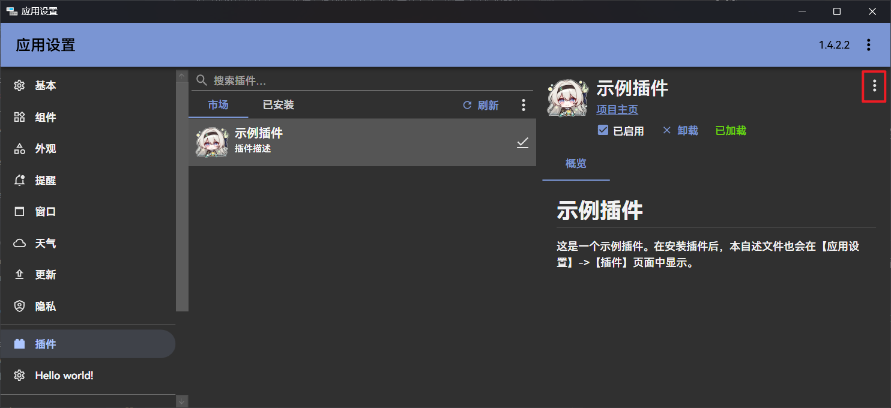
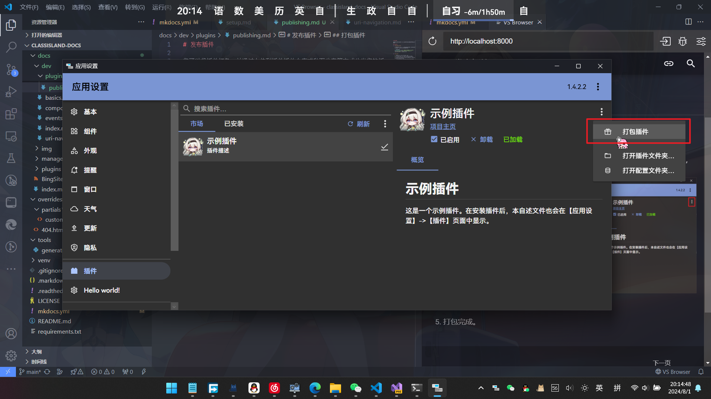

# 发布插件

您可以将插件打包、并通过上传到插件插件仓库或私下分享等方式分发您的插件。

## 打包插件

:::tabs#pack_method

@tab 一键打包（推荐）

在插件 SDK 1.6.0.5 及以上版本中，您可以在插件项目文件夹使用以下命令一键打包插件，并输出校验和等信息。

``` powershell
dotnet publish -p:CreateCipx=true
```

运行命令后，插件包和校验和信息会输出在项目目录下的 `cipx` 目录中。

@tab Powershell Core

在 Powershell Core 中使用以下命令将插件输出/发布目录打包到一个扩展名为`.cipx`的`zip`压缩文件中。

``` powershell
Compress-Archive -Path "（你的插件编译输出目录，如 E:\xxx\MyPlugin\bin\Release\net8.0-windows\）" -DestinationPath ./myplugin.cipx
```

@tab 手动打包

1. 将您的插件加载到 ClassIsland 中。
2. 在 ClassIsland 中打开[【应用设置】->【插件】](classisland://app/settings/classisland.plugins)。
3. 选择要打包的插件，点击插件详细界面的【更多选项…（右上角三个点）】，点击【打包插件…】

    

    

4. 选择保存插件包的位置。
5. 打包完成。
:::

## 上架到插件市场

[插件源仓库]: https://github.com/ClassIsland/PluginIndex

:::info
这里的插件市场指应用内置的插件源。
:::

**上架插件市场的插件必须满足以下条件：**

- 插件内容符合相关法律法规，无涉黄、涉政等敏感内容。
- 插件是符合[开源定义](https://opensource.org/osd)，并有开源许可证的开源项目。
- 代码存储库托管于 GitHub 上。

不符合以上条件的插件仍然能在本项目的插件 SDK 的开源许可（LGPLv3）下以其它形式自由分发，但不能上架插件市场。

要将插件上架到插件市场，您需要在在原来的插件清单的基础上，补充相关信息，并将补充后的插件清单文件上传到[插件源仓库]中。

以下是需要补充的信息：

| 属性名 | 类型 | 必填？ | 说明 | 示例
| -- | -- | -- | -- | -- |
| repoOwner | `string` | **是** | 插件的 GitHub 仓库所有者 | ClassIsland
| repoName | `string` | **是** | 插件的 GitHub 仓库名称 | ExamplePlugins
| assetsRoot | `string` | **是** | 插件的资源根目录，格式为`<默认分支>/<插件项目相对存储库的路径>` | master/ExamplePlugin
| artifactName | `string` | 否 | 指定插件 Release 中给用户要下载的插件包的工件名称，否则索引生成器将匹配第一个以`.cipx`为后缀的工件 | plugin.cipx
| tagPattern | `string` | 否 | 查找最新发行版时要匹配的 Tag 模式。如果设置，将查找匹配符合这个模式的 Tag，否则将使用最新的符合格式的 Tag | 1.\*.\*\*

例如：

```yaml title="classisland.example.yml" hl_lines="6-10"
id: classisland.example
name: 示例插件
description: 插件描述
entranceAssembly: "ClassIsland.ExamplePlugin.dll"
url: https://github.com/ClassIsland/ClassIsland
repoOwner: ClassIsland
repoName: ExamplePlugins
assetsRoot: master/HelloWorldPlugin
artifactName: plugin.cipx
tagPattern: 1.*.**

```

您还需要将打包后的插件上传到**您的插件的仓库**的 Release 中，并添加 MD5 校验信息。

> [!note]
> 如果您使用了一键打包，默认情况下已自动生成 MD5 校验信息，可以跳过此步骤。

:::tabs#pack_method

@tab 通过 Powershell

1. 在[此处](https://github.com/ClassIsland/ClassIsland/raw/master/tools/generate-md5.ps1)下载 MD5 计算 Powershell 脚本，并重命名为 `generate-md5.ps1`
2. 运行以下命令：
    ```powershell
    ./generate-md5.ps1 打包输出目录
    ```
    此命令将运行 MD5 计算脚本，并将符合格式要求的 MD5 校验信息输出到文件 `checksums.md` 中。
3. 上传插件包到 Releases，并在发行日志中填入 `checksums.md` 的内容。

@tab 手动添加

1. 利用 7z 等工具计算插件包的 MD5。
2. 上传插件包到 Releases，并按以下格式在发行日志中加入校验信息：
   ```markdown
   <!-- CLASSISLAND_PKG_MD5 {"插件包文件名": "得到的 MD5"} -->
   ```
   其中被注释标签包裹的 json 对象是一个以文件名为键，MD5 值为值的字典。如果有多个文件，可以扩充此字典。
:::

补充后的插件清单文件需要重命名为插件 id，并上传到[插件源仓库]根目录下的[`index/plugins-v2`](https://github.com/ClassIsland/PluginIndex/tree/main/index/plugins-v2)文件夹中。

> [!note]
> 您按照本方法上架的插件只会出现在 2.x 的插件市场中。要了解如何将您的插件上架到 1.x 的插件市场，[请见下文](#同时发布兼容-classisland-1x-和-classisland-2x-的插件)。

上传完成后，需要向源仓库发起 PR。您的插件将被审核，插件审核通过后即可进入插件市场。相关的下载信息将根据插件清单中的信息添加到插件源中。

## 同时发布兼容 ClassIsland 1.x 和 ClassIsland 2.x 的插件

您可以在将您的插件清单文件添加到 2.x 插件索引目录[`index/plugins-v2`](https://github.com/ClassIsland/PluginIndex/tree/main/index/plugins-v2)的同时将您的插件索引清单文件添加到 1.x 的索引目录[`index/plugins`](https://github.com/ClassIsland/PluginIndex/tree/main/index/plugins)中，实现同时在 1.x 和 2.x 的插件市场上架您的插件。

如果您同时在 Releases 中发布了面向 2.x 版本的 ClassIsland 插件，为了在 1.x 的版本的 ClassIsland 插件市场中下载到支持 1.x ClassIsland 版本的插件，您可能也需要在 1.x 插件索引中的插件清单中指定 `tagPattern` 属性，告诉索引生成器要使用的 Release。例如：

```yaml title="classisland.example.yml" hl_lines="10"
id: classisland.example
name: 示例插件
description: 插件描述
entranceAssembly: "ClassIsland.ExamplePlugin.dll"
url: https://github.com/ClassIsland/ClassIsland
repoOwner: ClassIsland
repoName: ExamplePlugins
assetsRoot: master/HelloWorldPlugin
artifactName: plugin.cipx
tagPattern: 1.*.**

```

在这个清单文件中我们设置了 `1.*.**` 的 Tag 模式，这样生成索引的时候就会使用符合这个模式的 Tag 的 Release，用户从 1.x 的插件市场中下载插件时就会从这个 Release 下载。

同理，如果有需要，我们也可以为添加到 2.x 版本的插件索引的清单文件规定要使用的 Release 的 Tag 模式。
